# Networkwalks Cybersecurity Internship – Week 2

## Footprinting, OSINT & Network Scanning

This repository documents my Week 2 practical work for the **Cybersecurity & Ethical Hacking Internship at Networkwalks**.

During this week, I completed four project modules covering reconnaissance, OSINT, domain footprinting, email/subdomain discovery, and local network scanning:

- **W2-PM1:** Footprinting & Reconnaissance with Multiple Kali Linux Tools
- **W2-PM3:** Footprinting with Maltego
- **W2-PM4:** Footprinting with theHarvester
- **W2-PM5:** Network Scanning with Zenmap
- **W2-PM-FINAL:** Detailed Week 2 Project Report

> **Ethical Use Notice:** All work in this repository was completed for educational purposes. Public reconnaissance was performed only against targets specified in the internship lab material, and local scanning was performed on my own network.

---

## Objectives

The main goal of Week 2 was to understand how reconnaissance and network discovery are carried out before deeper security testing.

The work focused on:

- Collecting publicly available domain information
- Fingerprinting web technologies
- Resolving domain and DNS information
- Inspecting HTTP response headers
- Detecting web application firewall technology
- Enumerating DNS infrastructure
- Using Maltego to visualize discovered information
- Using theHarvester for email and host discovery
- Discovering live hosts on a local network
- Viewing the network structure through Zenmap topology

---

# W2-PM1 – Footprinting with Multiple Kali Tools

For this module, I performed reconnaissance against the authorized internship target **networkwalks.com** using six tools available in Kali Linux.

## 1. WHOIS

Command:

```bash
whois networkwalks.com
```

The WHOIS query returned domain registration and infrastructure information.

### Key findings

- Registrar: **GoDaddy.com, LLC**
- Domain creation date: **6 November 2019**
- Registry expiry date: **6 November 2027**
- Registrant information was privacy protected through **Domains By Proxy, LLC**
- Name servers included:
  - `NS6135.HOSTGATOR.COM`
  - `NS6136.HOSTGATOR.COM`
- DNSSEC was shown as **unsigned**

### Evidence

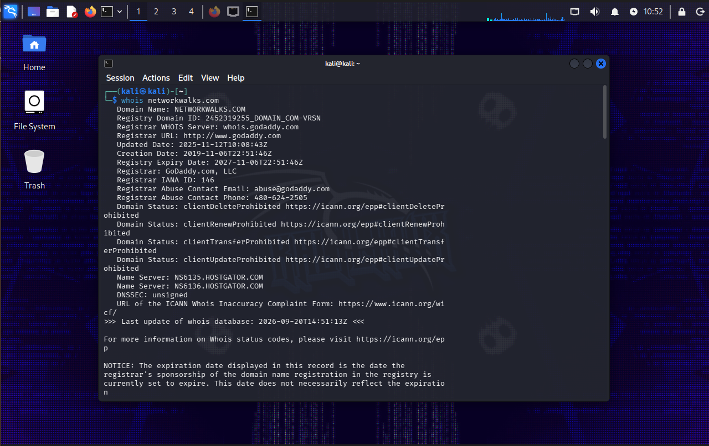

---

## 2. WhatWeb

Command:

```bash
whatweb networkwalks.com
```

WhatWeb was used to fingerprint the technologies exposed by the website.

### Key findings

The scan identified:

- Apache web server
- WordPress **7.1.1**
- WordPress Download Manager **3.3.58**
- Bootstrap **7.1.1**
- jQuery **3.7.1**
- Google Tag Manager
- HTML5
- Public contact email: `info@networkwalks.com`
- Server IP: `192.232.216.135`

The HTTP version of the site redirected to HTTPS.

### Evidence

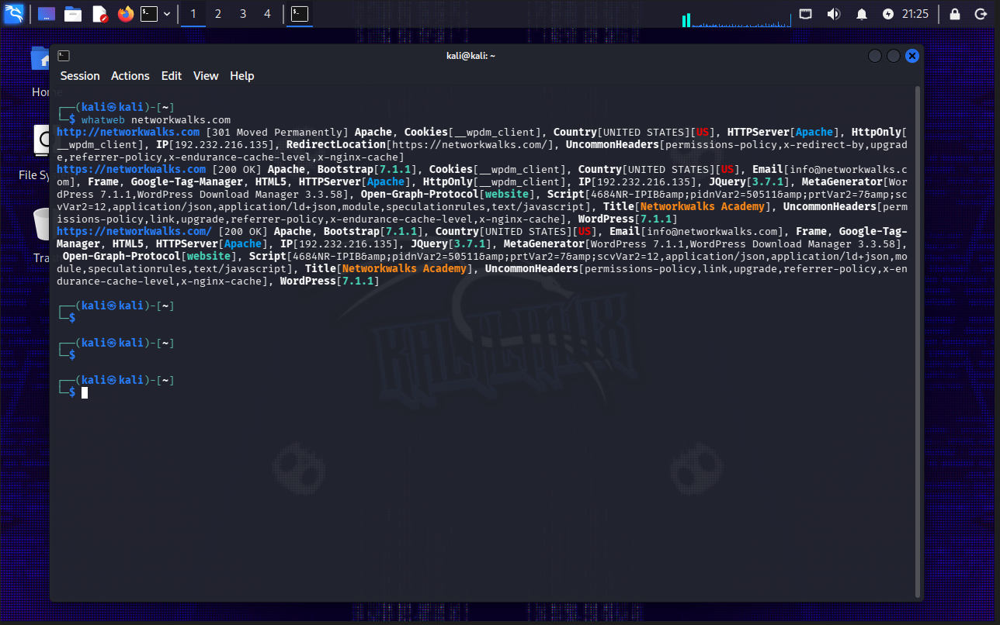

---

## 3. Nslookup

Command:

```bash
nslookup networkwalks.com
```

The lookup was performed using Google's public DNS resolver.

### Result

```text
networkwalks.com -> 192.232.216.135
```

This confirmed the IP address associated with the target domain at the time of testing.

### Evidence

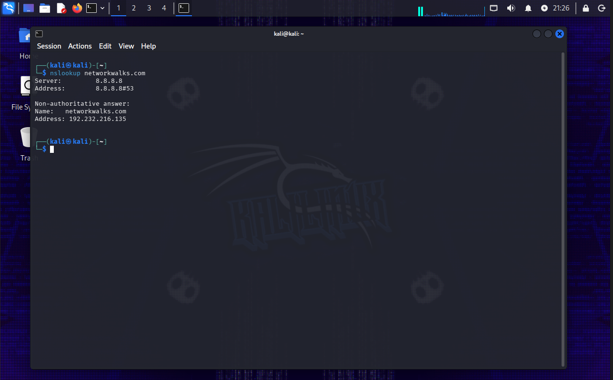

---

## 4. HTTP Header Inspection with Curl

Command:

```bash
curl -I https://networkwalks.com
```

The response returned:

- HTTP/2 `200 OK`
- Apache server
- WordPress-related caching headers
- Secure and HttpOnly cookie attributes
- WordPress REST API links including `/wp-json/`

The task demonstrated how response headers can reveal useful information about a web application's technology stack and configuration.

### Evidence

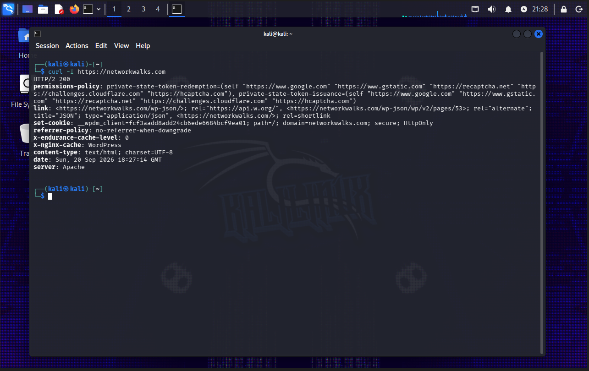

---

## 5. WAF Detection with Wafw00f

Command:

```bash
wafw00f networkwalks.com
```

### Result

Wafw00f detected:

```text
ModSecurity (SpiderLabs)
```

This showed that the website was protected by a detectable Web Application Firewall.

### Evidence

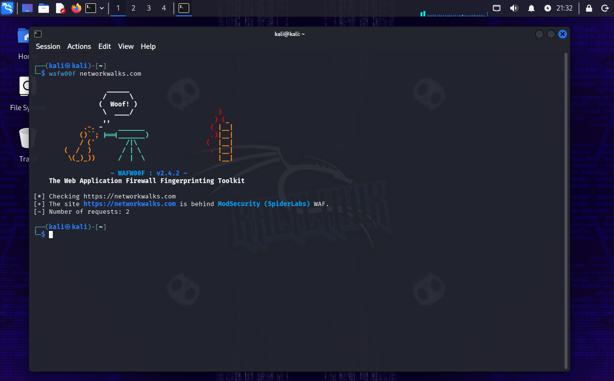

---

## 6. DNS Enumeration with DNSRecon

Command:

```bash
dnsrecon -d networkwalks.com
```

DNSRecon was used to gather additional DNS information.

### Key findings

The enumeration identified:

- SOA records
- NS records
- MX record
- A record
- TXT/SPF records
- Google site verification record
- Autodiscover SRV records
- DNS server software information

Examples from the scan included:

```text
A  networkwalks.com       192.232.216.135
MX mail.networkwalks.com  192.232.216.135
NS ns6135.hostgator.com
NS ns6136.hostgator.com
```

Eight SRV records were also returned during enumeration.

### Evidence

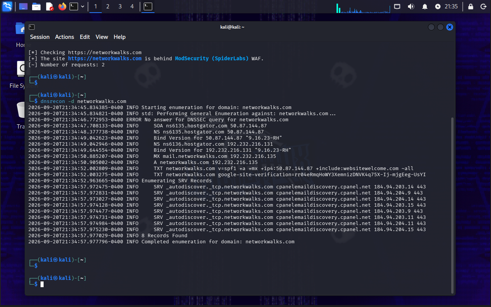

---

# W2-PM3 – Footprinting with Maltego

The objective of this module was to use **Maltego** to perform relationship-based reconnaissance against the authorized `networkwalks.com` domain.

I created a Domain entity for:

```text
networkwalks.com
```

and ran email-related transforms.

## Troubleshooting

During the task, Maltego initially returned the warning:

```text
Please input a valid 'engine ID' to use the Google API
```

This happened because one of the selected transforms depended on Google search configuration that was not available.

Instead of treating the failed transform as the end of the task, I reviewed the available transform options and used a working email discovery transform that did not depend on the missing Google configuration.

The task then completed successfully.

### Result

Maltego produced a relationship between:

```text
networkwalks.com
        |
        └── info@networkwalks.com
```

This also matched the public email previously identified with WhatWeb.

### Evidence

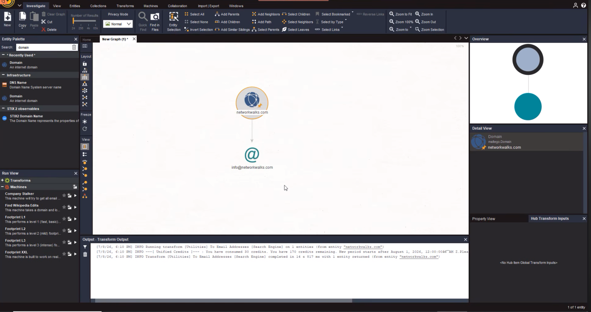

---

# W2-PM4 – Footprinting with theHarvester

For this module, I used **theHarvester 4.10.1** to collect publicly available information related to `microsoft.com`, following the assigned internship lab.

## Task 1 – Baidu Source

Command:

```bash
theHarvester -d microsoft.com -l 1000 -b baidu
```

### Results

The run returned:

- **4 email results**
- **7 hosts**
- No IP addresses from the Baidu source
- No people records

The host results included examples such as:

```text
account.microsoft.com
developer.microsoft.com
jobs.careers.microsoft.com
learn.microsoft.com
prod.support.services.microsoft.com
spocdev.microsoft.com
support.microsoft.com
```

### Evidence

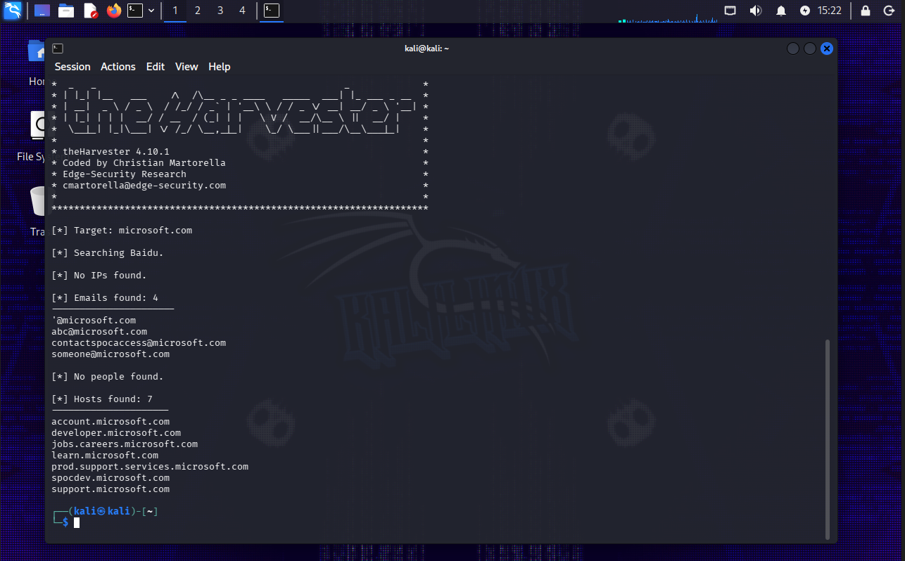

---

## Task 2 – All Available Sources

Command:

```bash
theHarvester -d microsoft.com -l 50 -b all
```

Running all sources produced an important practical limitation.

A number of theHarvester modules required API credentials that were not configured, including services such as Censys, Shodan, GitHub, Hunter, VirusTotal, SecurityScorecard, and others.

These appeared as missing API key warnings in the output.

Other sources continued to execute successfully.

### Overall collected output

The completed run reported:

- **138 IP addresses**
- **3 email addresses**
- **9,966 hosts**

This exercise showed that OSINT tools depend heavily on external data providers. Running a tool with `-b all` does not mean that every provider will return data unless the required credentials are configured.

### Evidence

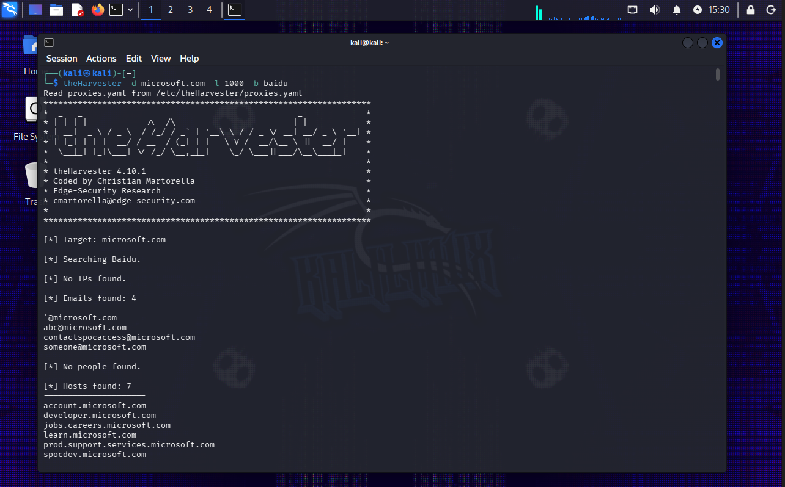

---

# W2-PM5 – Network Scanning with Zenmap

The final practical module focused on network discovery using **Zenmap**, the graphical interface for Nmap.

Unlike the earlier reconnaissance tasks, this scan was performed against **my own local network**.

## Local Network Configuration

Using Windows `ipconfig`, I identified:

```text
IPv4 Address: 192.168.100.18
Subnet Mask:  255.255.255.0
Default Gateway: 192.168.100.1
```

Therefore, the local network was:

```text
192.168.100.0/24
```

---

## Host Discovery

Zenmap identified three active hosts:

```text
192.168.100.1
192.168.100.18
192.168.100.53
```

The results showed the router/gateway, my own Windows system, and another active device on the LAN.

The scan also displayed manufacturer information for some MAC addresses, including **Huawei Technologies** and **LG Electronics**.

### Evidence

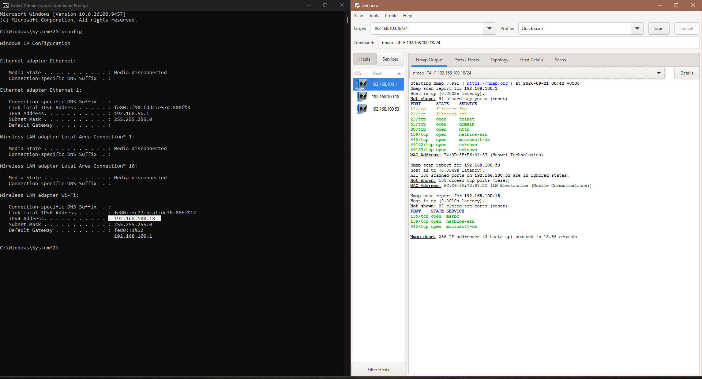

---

## Network Topology

After completing the scan, I used Zenmap's **Topology** view to visualize the discovered devices.

The topology clearly showed:

- Localhost
- `192.168.100.1`
- `192.168.100.18`
- `192.168.100.53`

A copy of the exported topology is also included in this repository.

### Evidence

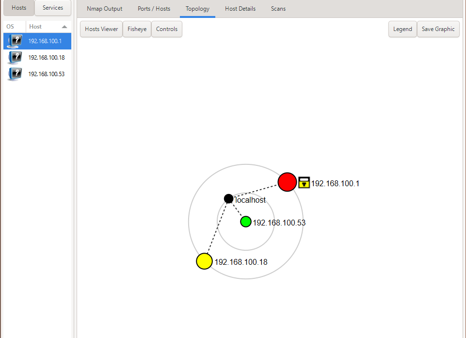

[View exported topology PDF](evidence/zenmap-topology.pdf)

---

# Tools Used

| Tool | Purpose |
|---|---|
| Kali Linux | Reconnaissance environment |
| WHOIS | Domain registration information |
| WhatWeb | Website technology fingerprinting |
| Nslookup | DNS resolution |
| Curl | HTTP header inspection |
| Wafw00f | Web Application Firewall detection |
| DNSRecon | DNS enumeration |
| Maltego | Relationship-based OSINT and visualization |
| theHarvester | Email, host, subdomain, and public-data discovery |
| Zenmap / Nmap | Local network scanning and host discovery |
| Windows CMD | Local IP and subnet identification |

---

# What I Learned

Week 2 gave me a clearer understanding of how reconnaissance connects different pieces of information.

A single command usually gives only one part of the picture. WHOIS identifies registration and name server information, WhatWeb shows the technologies exposed by a website, DNS tools reveal infrastructure, Maltego visualizes relationships, and theHarvester brings together information from multiple public sources.

I also encountered real tool limitations rather than only following ideal lab output. Maltego required an alternative transform when the Google-based transform could not run, while theHarvester showed how much modern OSINT tooling depends on external API keys.

The Zenmap task was useful for connecting reconnaissance concepts with networking. Instead of examining a public domain, I worked with my own `/24` LAN, discovered the active devices and viewed how they appeared in the topology.

---

# Repository Structure

```text
NETWORKWALKS-B083-WK2-RECONNAISSANCE-AND-NETWORK-SCANNING/
│
├── README.md
├── report/
│   └── Networkwalks_Week2_Cybersecurity_Project_Report_Ihtisham_Khan.docx
│
└── evidence/
    ├── pm1-whois.png
    ├── pm1-whatweb.png
    ├── pm1-nslookup.png
    ├── pm1-curl-headers.png
    ├── pm1-wafw00f.png
    ├── pm1-dnsrecon.png
    ├── pm3-maltego-email.png
    ├── pm4-theharvester-baidu.png
    ├── pm4-theharvester-all.png
    ├── pm5-zenmap-scan.png
    ├── pm5-zenmap-topology.png
    ├── pm5-lab-completion.png
    └── zenmap-topology.pdf
```

---

# Project Report

The detailed Week 2 report covering methodology, findings, troubleshooting, observations, risk discussion, recommendations, and evidence is available in the [`report`](report/) directory.

---

## Author

**Ihtisham Khan**  
Computer Science Graduate | Cybersecurity Learner | Networkwalks Intern
- Focus: Cybersecurity, Networking, Ethical Hacking, OSINT
---
## Internship

**Program:** Cybersecurity & Ethical Hacking Internship  
**Organization:** Networkwalks  
**Batch:** B083  
**Week:** 2  

---

## Disclaimer

This repository documents controlled educational cybersecurity exercises. Reconnaissance and scanning should only be performed against systems you own or systems for which you have explicit authorization.
